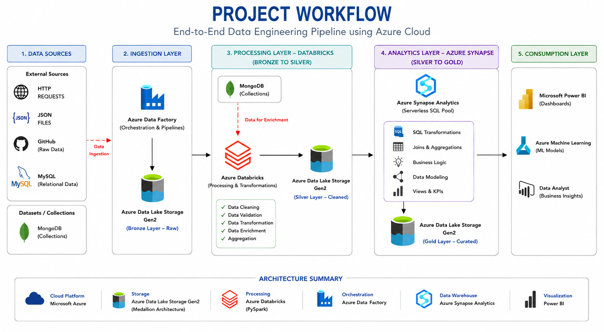
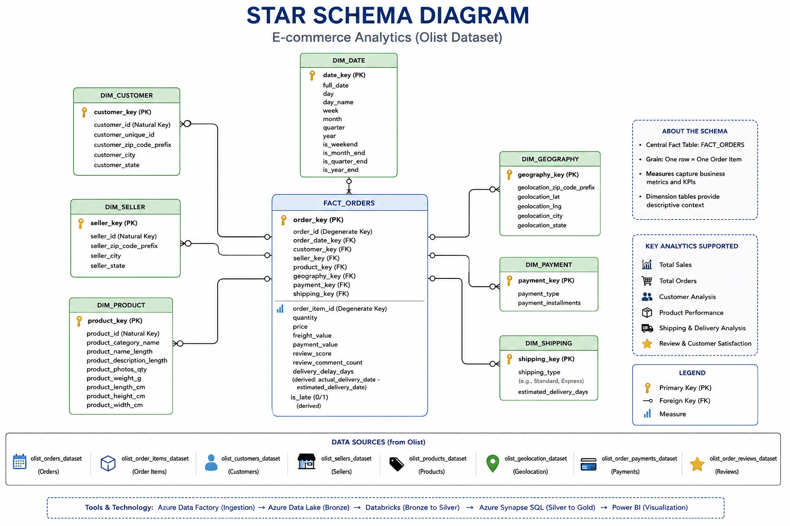

# 🛒 Olist E-Commerce Data Engineering Pipeline

### End-to-End Azure Medallion Architecture — Bronze → Silver → Gold


A production-style, cloud-native data engineering pipeline built on **Microsoft Azure** that ingests the Olist Brazilian E-Commerce dataset from three heterogeneous sources (GitHub, MySQL, MongoDB), cleans and denormalizes it with **PySpark on Databricks**, curates it into a **star schema** with **Azure Synapse Analytics**, and lands it in a **Bronze → Silver → Gold** medallion lakehouse on **Azure Data Lake Storage Gen2** — ready for BI and ML consumption.

---

## 📑 Table of Contents

- [Architecture](#-architecture)
- [Tech Stack](#-tech-stack)
- [Dataset](#-dataset)
- [Pipeline Walkthrough](#-pipeline-walkthrough)
  - [1. Ingestion Layer](#1-ingestion-layer--azure-data-factory)
  - [2. Bronze Layer](#2-bronze-layer--raw-zone)
  - [3. Cleaning — Bronze → Silver](#3-cleaning--bronze--silver-databricks)
  - [4. Denormalization — Silver Enrichment](#4-denormalization--silver-enrichment-databricks)
  - [5. Analytics Layer — Silver → Gold](#5-analytics-layer--silver--gold-azure-synapse)
  - [6. Consumption Layer](#6-consumption-layer)
- [Data Model](#-data-model)
- [Repository Structure](#-repository-structure)
- [Getting Started](#-getting-started)
- [Configuration & Security Notes](#-configuration--security-notes)
- [Roadmap](#-roadmap)
- [Author](#-author)

---

## 🏗 Architecture



The pipeline follows five stages: **Sources → Ingestion → Processing (Bronze→Silver) → Analytics (Silver→Gold) → Consumption**, mirroring a real-world enterprise lakehouse pattern.

<details>
<summary>Data Flow Diagram (OLTP → ETL/ELT → OLAP)</summary>


</details>

---

## 🧰 Tech Stack

| Layer | Technology | Purpose |
|---|---|---|
| **Cloud Platform** | Microsoft Azure | Hosts the entire pipeline |
| **Storage** | Azure Data Lake Storage Gen2 | Bronze / Silver / Gold medallion lakehouse |
| **Orchestration & Ingestion** | Azure Data Factory | Parameterized copy pipeline from GitHub → Bronze |
| **Processing** | Azure Databricks (PySpark) | Cleaning, deduplication, joins, denormalization |
| **Data Warehouse** | Azure Synapse Analytics (Serverless SQL Pool) | Silver → Gold transformation, CETAS, views |
| **Source Systems** | MySQL, MongoDB | Secondary OLTP-style sources feeding the pipeline |
| **Visualization (target)** | Power BI | Dashboards & reporting off the Gold layer |
| **Languages** | Python, PySpark, SQL | Notebooks and warehouse scripts |

---

## 📊 Dataset

This project uses the **Olist Brazilian E-Commerce** public dataset — real, anonymized order data from the Olist marketplace, distributed as CSVs and joined with a product-category translation table. Two ingestion paths are simulated on top of the raw CSVs: the payments file is loaded into **MySQL**, and the category-translation file into **MongoDB**, to exercise multi-source ingestion.

| Source File | Rows | Columns | Description |
|---|---:|---:|---|
| `olist_orders_dataset.csv` | 99,441 | 8 | Order status & lifecycle timestamps |
| `olist_customers_dataset.csv` | 99,441 | 5 | Customer & location identifiers |
| `olist_order_items_dataset.csv` | 112,650 | 7 | Line items per order (price, freight) |
| `olist_order_payments_dataset.csv` | 103,886 | 5 | Payment type & installments *(→ MySQL)* |
| `olist_order_reviews_dataset.csv` | 104,719 | 7 | Customer review scores & comments |
| `olist_products_dataset.csv` | 32,951 | 9 | Product attributes & dimensions |
| `olist_sellers_dataset.csv` | 3,095 | 4 | Seller & location identifiers |
| `olist_geolocation_dataset.csv` | 1,000,163 | 5 | Zip-code-level lat/lng |
| `product_category_name_translation.csv` | 70 | 2 | PT → EN category names *(→ MongoDB)* |

**~1.55M raw records across 9 source tables.**

<details>
<summary>📈 Sample insights straight from the raw data</summary>

- **Date range:** Sep 2016 – Oct 2018
- **99,441** orders across **96,096** unique customers and **3,095** sellers
- **97.0%** of orders reached `delivered` status (625 canceled, 609 unavailable)
- **Average review score:** 4.09 / 5
- **Total payment value:** R$16.0M · **Total freight value:** R$2.25M
- **Top states by order volume:** SP (41,746) → RJ (12,852) → MG (11,635) → RS (5,466) → PR (5,045)

</details>

---

## 🔄 Pipeline Walkthrough

### 1. Ingestion Layer — Azure Data Factory

📁 [`Ingestion/Azure Data Factory/`](./Ingestion/Azure%20Data%20Factory/)


A **parameterized Lookup + ForEach + Copy** pattern drives ingestion:

1. A **Lookup** activity reads [`ForEachInput.json`](./Ingestion/Azure%20Data%20Factory/ForEachInput.json) — an array of `{csv_relative_url, file_name}` pairs pointing at the raw Olist CSVs hosted on GitHub.
2. A **ForEach** activity iterates the array.
3. Inside the loop, a **Copy Data** activity pulls each file over HTTP and lands it, unmodified, into the **Bronze** container of ADLS Gen2.

This means adding a new source file to the pipeline is just adding an entry to the JSON array — no pipeline redesign needed.

In parallel, two notebooks seed the two secondary sources used later for multi-source joins:
- [`Ingestion/MySql/Data_Ingestion_MySQL.ipynb`](./Ingestion/MySql/Data_Ingestion_MySQL.ipynb) loads the payments CSV into a MySQL table.
- [`Ingestion/MongoDB/Data_Ingestion_MongoDB.ipynb`](./Ingestion/MongoDB/Data_Ingestion_MongoDB.ipynb) loads the category-translation CSV into a MongoDB collection.

### 2. Bronze Layer — Raw Zone

📁 [`Medallion-Based-Storage-System/Bronze/`](./Medallion-Based-Storage-System/Bronze/)

The 8 Olist CSVs land here exactly as sourced — no schema enforcement, no cleaning — preserving full fidelity for reprocessing or audit.

### 3. Cleaning — Bronze → Silver (Databricks)

📓 [`Data-Processing/Data-Ingestion-and-Cleaning.ipynb`](./Data-Processing/Data-Ingestion-and-Cleaning.ipynb)

- Authenticates to ADLS Gen2 from Databricks using **OAuth via a Microsoft Entra app registration** (service principal).
- Reads all 8 Bronze CSVs into Spark DataFrames with schema inference.
- Pulls the `product_category_translation` collection from **MongoDB** via `pymongo` for later enrichment.
- Runs a per-dataset **data-quality check** and two cleaning passes:

```python
def missing_values(df, df_name):
    print(f"Missing Values in: {df_name}")
    df.select([count(when(col(c).isNull(), 1)).alias(c) for c in df.columns]).show()

for key, _ in datasets.items():
    globals()[key] = globals()[key].na.drop(how="all")   # drop fully-null rows
    globals()[key] = globals()[key].dropDuplicates()      # remove duplicate rows
```

- Writes each cleaned dataset back to ADLS Gen2 as `silver/<name>_df/*.csv`.

### 4. Denormalization — Silver Enrichment (Databricks)

📓 [`Data-Processing/Databricks-ELT.ipynb`](./Data-Processing/Databricks-ELT.ipynb)

Builds one wide, order-grain table by chaining left joins across the cleaned Silver datasets, then enriches it with the MongoDB category-translation table:

```python
order_customer_df = orders_df.join(
    customer_df, orders_df.customer_id == customer_df.customer_id, "left"
).drop(orders_df.customer_id)

order_payments_df = order_customer_df.join(
    payments_df, order_customer_df.order_id == payments_df.order_id, "left"
).drop(payments_df.order_id)

# ...chained further through order items → products → sellers,
# then joined against the MongoDB category-translation lookup
```

The result is written to `silver/transformed_data/` in **Parquet** — the single source table that Synapse reads from next.

### 5. Analytics Layer — Silver → Gold (Azure Synapse)

📁 [`Azure-Synpase/`](./Azure-Synpase/) — six numbered scripts run in order against a **Serverless SQL Pool**:

| # | Script | Purpose |
|---|---|---|
| 01 | `01_CreatingMasterKey.sql` | Creates a database master key + a database-scoped credential backed by a **Managed Identity** (no stored passwords) |
| 02 | `02_ReadingTransformedData.sql` | Sanity-check query over the transformed Parquet via `OPENROWSET` |
| 03 | `03_CreatingTemporaryView.sql` | Creates `dbo.final2`, filtered to `order_status = 'delivered'` — the business rule that only completed orders reach analytics |
| 04 | `04_CreationOfExternalFileFormat.sql` | Defines a reusable Parquet + Snappy external file format |
| 05 | `05_CreationOfExternalDataSource.sql` | Points an external data source at the **Gold** container, secured via the managed-identity credential |
| 06 | `06_SendingDataToGoldLayer.sql` | `CREATE EXTERNAL TABLE ... AS SELECT` — materializes the curated view into `gold.finalTable` |

```sql
CREATE EXTERNAL TABLE gold.finalTable
WITH (
    LOCATION    = 'Final',
    DATA_SOURCE = goldlayer,
    FILE_FORMAT = extfileformat
)
AS
SELECT * FROM olist.dbo.final2;
```

### 6. Consumption Layer

The Gold layer is exposed through the Synapse serverless SQL endpoint, ready to be plugged into **Power BI** for dashboards, ad-hoc SQL reporting, or downstream **ML models** — as shown in the architecture diagram above.

---

## 🗃 Data Model

The Gold layer is modeled as a **star schema** centered on order-item grain, purpose-built for fast analytical queries.



- **`FACT_ORDERS`** — one row per order item; measures include `price`, `freight_value`, `payment_value`, `review_score`, and two derived fields: `delivery_delay_days` (actual − estimated delivery date) and `is_late`.
- **Dimensions:** `DIM_CUSTOMER`, `DIM_SELLER`, `DIM_PRODUCT`, `DIM_DATE`, `DIM_GEOGRAPHY`, `DIM_PAYMENT`, `DIM_SHIPPING`.
- **Supports:** total sales & orders, customer analysis, product performance, shipping & delivery analysis, and review/satisfaction analysis.

<details>
<summary>Entity-Relationship Diagram (source-level keys)</summary>


</details>

---

## 📂 Repository Structure

```text
My Project/
├── Azure-Synpase/                        # Silver → Gold SQL scripts (Synapse Serverless SQL Pool)
│   ├── 01_CreatingMasterKey.sql
│   ├── 02_ReadingTransformedData.sql
│   ├── 03_CreatingTemporaryView.sql
│   ├── 04_CreationOfExternalFileFormat.sql
│   ├── 05_CreationOfExternalDataSource.sql
│   └── 06_SendingDataToGoldLayer.sql
├── Data-Processing/                      # Databricks notebooks (Bronze → Silver)
│   ├── Data-Ingestion-and-Cleaning.ipynb
│   └── Databricks-ELT.ipynb
├── Diagrams/                             # Architecture & data-model diagrams
│   ├── Workflow.png
│   ├── Data Flow Diagram.png
│   ├── Entity-Relation-Diagram.png
│   └── Star-Schema-Diagram.png
├── Ingestion/
│   ├── Azure Data Factory/               # ADF pipeline: GitHub → ADLS Bronze
│   │   ├── Data Ingestion Pipeline.png
│   │   └── ForEachInput.json
│   ├── MongoDB/                          # Seeds category-translation lookup into MongoDB
│   │   └── Data_Ingestion_MongoDB.ipynb
│   └── MySql/                            # Seeds payments data into MySQL
│       └── Data_Ingestion_MySQL.ipynb
└── Medallion-Based-Storage-System/       # Local mirror of the ADLS Gen2 container
    ├── Bronze/                           # Raw Olist CSVs
    ├── Silver/                           # Cleaned + denormalized data
    └── Gold/                             # Curated, analytics-ready output
```

---

## 🚀 Getting Started

To reproduce this pipeline end-to-end in your own Azure subscription:

1. **Provision Azure resources:** a resource group, an ADLS Gen2 storage account with a container (e.g. `olistdata`), an Azure Data Factory instance, an Azure Databricks workspace, and an Azure Synapse Analytics workspace (serverless SQL pool).
2. **Register a Microsoft Entra app** (service principal) and grant it `Storage Blob Data Contributor` on the storage account — this is what Databricks uses to authenticate via OAuth.
3. **Stand up MySQL and MongoDB instances** for the two secondary sources (any hosted or managed instance works).
4. **Seed the secondary sources** by running `Ingestion/MySql/Data_Ingestion_MySQL.ipynb` and `Ingestion/MongoDB/Data_Ingestion_MongoDB.ipynb` once.
5. **Deploy and trigger the ADF pipeline** in `Ingestion/Azure Data Factory/` to land the GitHub-hosted CSVs into Bronze.
6. **Run the Databricks notebooks in order:**
   `Data-Ingestion-and-Cleaning.ipynb` → produces Silver, then `Databricks-ELT.ipynb` → produces the denormalized `transformed_data`.
7. **Execute the Synapse scripts** in `Azure-Synpase/` in numeric order (01 → 06) to build the Gold layer and `gold.finalTable`.
8. **Connect Power BI** (or any BI/ML tool) to the Synapse serverless SQL endpoint to consume the Gold layer.

---

## 🔒 Configuration & Security Notes

- **Never hardcode credentials** in notebooks or SQL scripts. Store the Entra app's client secret, MongoDB/MySQL connection strings, and any warehouse passwords in **Azure Key Vault**, and reference them via **Databricks secret scopes** or ADF's Key Vault–linked service instead.
- Prefer **Managed Identity** over stored secrets wherever a resource supports it — the Synapse scripts here already do this for Gold-layer access (`01_CreatingMasterKey.sql`, `05_CreationOfExternalDataSource.sql`).
- Before pushing this repository publicly, double-check every notebook and `.sql` file for values that look like connection strings, keys, or passwords — even ones left in during local development.

---

## 🗺 Roadmap

- [ ] Incremental / watermark-based loading instead of full overwrite per run
- [ ] Data-quality checks (e.g. Great Expectations) between Bronze and Silver
- [ ] CI/CD for ADF pipelines and Databricks notebooks
- [ ] Published Power BI dashboard (`.pbix`) consuming `gold.finalTable`
- [ ] Orchestration hand-off from ADF triggers to a scheduled end-to-end run

---

## 👤 Author

**Mukut Arman Ekka**
B.Tech, Computer Science & Engineering — NIT Delhi

Feel free to connect or open an issue if you have questions about the pipeline design.
