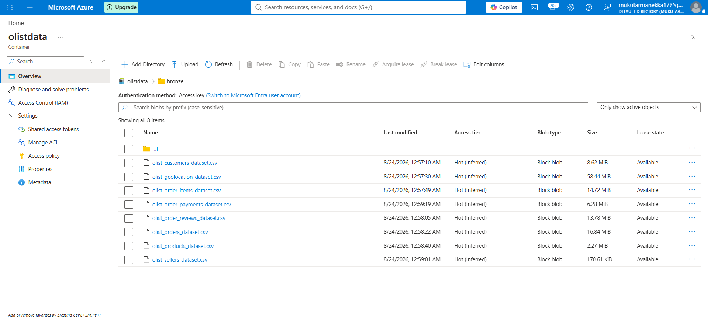
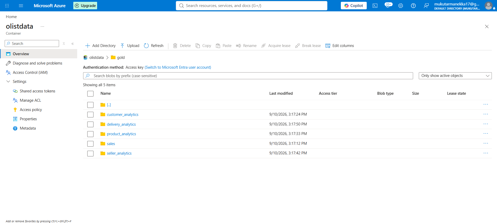
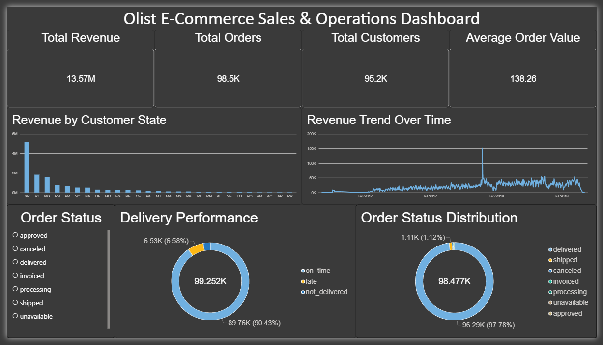
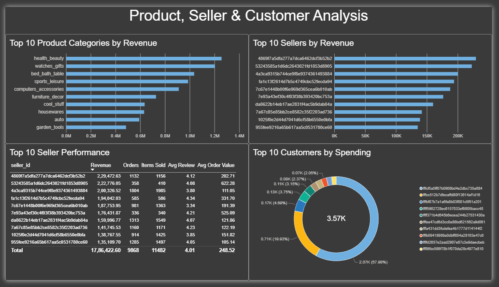

# 🛒 Olist E-Commerce Data Engineering Pipeline

### End-to-End Azure Lakehouse — Bronze → Silver → Gold (ELT)


A cloud-native data engineering pipeline built on **Microsoft Azure** that ingests the Olist Brazilian E-Commerce dataset from three heterogeneous sources (GitHub, MySQL, MongoDB), orchestrates the whole flow with **Azure Data Factory**, cleans and curates it with **PySpark on Azure Databricks**, and lands it in a **Bronze → Silver → Gold** medallion lakehouse on **Azure Data Lake Storage Gen2** — ready for **Power BI** dashboards.

---

## 📑 Table of Contents

- [Architecture](#-architecture)
- [Tech Stack](#-tech-stack)
- [Dataset](#-dataset)
- [Pipeline Walkthrough](#-pipeline-walkthrough)
  - [1. Ingestion Layer — Azure Data Factory](#1-ingestion-layer--azure-data-factory)
  - [2. Bronze Layer — Raw Zone](#2-bronze-layer--raw-zone)
  - [3. Silver Layer — Cleaning & Standardization](#3-silver-layer--cleaning--standardization-databricks)
  - [4. Gold Layer — Curated Analytics Tables](#4-gold-layer--curated-analytics-tables-databricks)
  - [5. End-to-End Orchestration](#5-end-to-end-orchestration)
  - [6. Consumption — Power BI](#6-consumption--power-bi)
- [Data Model](#-data-model)
- [Repository Structure](#-repository-structure)
- [Getting Started](#-getting-started)
- [Configuration & Security Notes](#-configuration--security-notes)
- [Possible Next Steps](#-possible-next-steps)
- [Author](#-author)

---

## 🏗 Architecture


The pipeline follows five stages — **Ingest → Store (Raw) → Transform & Clean → Model (OLAP) → Analyze** — mirroring a real-world enterprise lakehouse pattern.

<details>
<summary>Data Flow Diagram (OLTP → ELT → OLAP)</summary>


</details>

---

## 🧰 Tech Stack

| Layer | Technology | Purpose |
|---|---|---|
| **Cloud Platform** | Microsoft Azure | Hosts the entire pipeline |
| **Storage** | Azure Data Lake Storage Gen2 | Bronze / Silver / Gold medallion lakehouse |
| **Orchestration & Ingestion** | Azure Data Factory | Lookup + ForEach + Copy pipeline from GitHub → Bronze, chained into an end-to-end pipeline |
| **Processing** | Azure Databricks (PySpark) | Cleaning, deduplication, quarantining, joins, and Gold-layer aggregation |
| **Secondary Sources** | MySQL, MongoDB | Demonstrate multi-source ingestion (payments, category translation) |
| **Visualization** | Power BI | Sales, customer, product, seller and delivery dashboards off the Gold layer |
| **Languages** | Python, PySpark, SQL | Notebooks and data-quality checks |

---

## 📊 Dataset

This project uses the **Olist Brazilian E-Commerce** public dataset — real, anonymized order data from the Olist marketplace. The payments file is additionally loaded into **MySQL** and the category-translation file into **MongoDB**, to exercise multi-source ingestion patterns.

| Source File | Rows | Columns | Description |
|---|---:|---:|---|
| `olist_customers_dataset.csv` | 99,441 | 5 | Customer & location identifiers |
| `olist_geolocation_dataset.csv` | 1,000,163 | 5 | Zip-code-level lat/lng |
| `olist_order_items_dataset.csv` | 112,650 | 7 | Line items per order (price, freight) |
| `olist_order_payments_dataset.csv` | 103,886 | 5 | Payment type & installments *(→ MySQL)* |
| `olist_order_reviews_dataset.csv` | 104,719 | 7 | Customer review scores & comments |
| `olist_orders_dataset.csv` | 99,441 | 8 | Order status & lifecycle timestamps |
| `olist_products_dataset.csv` | 32,951 | 9 | Product attributes & dimensions |
| `olist_sellers_dataset.csv` | 3,095 | 4 | Seller & location identifiers |
| `product_category_name_translation.csv` | 70 | 2 | PT → EN category names *(→ MongoDB)* |

**~1.56M raw records across 9 source files**, all landed into Bronze by the ingestion pipeline.

<details>
<summary>📈 Headline numbers from the Power BI dashboards in this repo</summary>

- **Total revenue:** R$13.57M across **98.5K** orders and **95.2K** unique customers
- **Average order value:** R$138.26
- **Delivery performance:** ~90% of orders arrive **on time**
- **Top state by revenue:** SP, by a wide margin over RJ and MG
- **Top product category by revenue:** `health_beauty`, followed by `watches_gifts` and `bed_bath_table`

</details>

---

## 🔄 Pipeline Walkthrough

### 1. Ingestion Layer — Azure Data Factory

📁 [`Orchestration/Azure Data Factory/Data-Ingestion-Pipeline/`](./Orchestration/Azure%20Data%20Factory/Data-Ingestion-Pipeline/)


A parameterized **Lookup + ForEach + Copy** pattern drives ingestion:

1. A **Lookup** activity reads [`ForEachInput.json`](./Orchestration/Azure%20Data%20Factory/Data-Ingestion-Pipeline/ForEachInput.json) — an array of `{csv_relative_url, file_name}` pairs pointing at the raw Olist CSVs hosted on GitHub.
2. A **ForEach** activity iterates the array.
3. Inside the loop, a **Copy Data** activity pulls each file over HTTP and lands it, unmodified, into the **Bronze** container of ADLS Gen2.

Adding a new source file is just adding an entry to the JSON array — no pipeline redesign needed.

In parallel, two standalone notebooks demonstrate ingestion into secondary, heterogeneous sources:
- [`Ingestion/MySql/Data_Ingestion_MySQL.ipynb`](./Ingestion/MySql/Data_Ingestion_MySQL.ipynb) loads the payments CSV into a MySQL table.
- [`Ingestion/MongoDB/Data_Ingestion_MongoDB.ipynb`](./Ingestion/MongoDB/Data_Ingestion_MongoDB.ipynb) loads the category-translation CSV into a MongoDB collection.

> In the current Silver notebook, the payments table is read directly from Bronze, while the MongoDB category-translation collection is the one actually joined back in during Silver enrichment (see below) — the MySQL notebook stands on its own as a relational-source ingestion example.

### 2. Bronze Layer — Raw Zone

📁 [`Medallion-Based-Storage-System/Bronze/`](./Medallion-Based-Storage-System/Bronze/)



The 8 Olist CSVs land here exactly as sourced — no schema enforcement, no cleaning — preserving full fidelity for reprocessing or audit.

### 3. Silver Layer — Cleaning & Standardization (Databricks)

📓 [`Data-Processing/Silver_Transformation.ipynb`](./Data-Processing/Silver_Transformation.ipynb)

- Authenticates to ADLS Gen2 from Databricks via **OAuth client-credentials** against a Microsoft Entra app registration.
- Reads all 8 Bronze CSVs into Spark DataFrames and runs a schema, row-count, null-count, and duplicate audit on every one of them before touching the data.
- Applies table-specific cleaning:
  - **Geolocation** — drops exact duplicate rows.
  - **Reviews** — re-reads the CSV with `multiLine`/`quote`/`escape` options to correctly parse embedded newlines and quotes in free-text comments, casts `review_score` to `int`, parses the date/timestamp columns, trims comment text, and converts empty strings to `NULL`.
  - **Customers / Sellers** — verifies key uniqueness and trims the frame down to the columns needed downstream.
  - **Products** — casts every dimension/weight column to `int` and checks for negative values.
  - **Orders** — casts timestamp columns, then flags rows that are **chronologically impossible** (e.g. delivered before purchased) and routes them to a separate `orders_quarantine` Delta table instead of silently dropping or keeping bad data.
  - **Order Items / Payments** — casts numeric and timestamp columns, using `decimal(10,2)` for monetary fields.
- Adds `source_system` and `processing_timestamp` audit columns to every cleaned table.
- Enriches **Products** with the MongoDB `product_category_translation` collection (pulled via `pymongo`) through a left join, translating category names from Portuguese to English.
- Writes each cleaned table to `silver/<table_name>/` as **Delta**: `customers`, `sellers`, `products`, `orders`, `order_items`, `payments`, `reviews`, `geolocation`, plus `quarantine/orders` for the rejected rows.

### 4. Gold Layer — Curated Analytics Tables (Databricks)

📓 [`Data-Processing/Gold_Transformation.ipynb`](./Data-Processing/Gold_Transformation.ipynb)



Reads the Silver Delta tables and re-validates row counts, business-key uniqueness, and schemas before building five purpose-built, audit-stamped analytics tables:

| Gold Table | Grain | Rows | What it captures |
|---|---|---:|---|
| `sales` | one row per order item | 112,413 | Item price/freight, `total_item_value`, per-order payment total, per-order average review score, customer/seller/product/location attributes |
| `customer_analytics` | one row per customer | 95,237 | Lifetime orders/items, spend breakdown, average order value, average review score, first/last order date |
| `product_analytics` | one row per product | 32,890 | Items sold, revenue, average selling price, average review score, first/last sale date |
| `seller_analytics` | one row per seller | 3,090 | Same shape as product analytics, plus average order value |
| `delivery_analytics` | one row per order | 99,252 | `delivery_days`, `delivery_delay_days` vs. estimate, `delivery_status` (`on_time` / `late` / `not_delivered`), `carrier_handling_days` |

Every table goes through the same discipline before being written: a duplicate-grain check, a null/negative-value check on the key metrics, an audit-column stamp (`source_system`, `processing_timestamp`), and a reload-and-reverify pass immediately after the write.

### 5. End-to-End Orchestration

📁 [`Orchestration/Azure Data Factory/End-To-End-Pipeline/`](./Orchestration/Azure%20Data%20Factory/End-To-End-Pipeline/)


A single ADF pipeline, `End_To_End_Pipeline`, chains the whole flow: **Execute Pipeline** (the Data Ingestion Pipeline above) → **Notebook activity** running `Silver_Transformation` on Databricks → **Notebook activity** running `Gold_Transformation` on Databricks. One trigger takes raw CSVs all the way to curated Gold tables.

### 6. Consumption — Power BI

📁 [`Power-BI/`](./Power-BI/)

**Sales & Operations Dashboard** — revenue, orders, customers and AOV at a glance, revenue by customer state, revenue trend over time, order-status distribution, and on-time vs. late delivery performance.



**Product, Seller & Customer Analysis** — top 10 categories and sellers by revenue, a seller performance table (orders, items, average review, AOV), and top customers by spend.



---

## 🗃 Data Model


The Gold layer was designed around this **star schema** — a `FACT_ORDERS` table at order-item grain surrounded by `DIM_CUSTOMER`, `DIM_SELLER`, `DIM_PRODUCT`, `DIM_DATE`, `DIM_GEOGRAPHY`, `DIM_PAYMENT`, and `DIM_SHIPPING`. The pipeline originally targeted **Azure Synapse Analytics** for this Silver → Gold step; that dependency was later removed (see commit history) in favor of doing both Silver and Gold transformations directly in Databricks. As a result, the *delivered* Gold layer implements the same analytical intent as five wide, purpose-built Delta tables (`sales`, `customer_analytics`, `product_analytics`, `seller_analytics`, `delivery_analytics`) rather than physically separate fact/dimension tables — see [Possible Next Steps](#-possible-next-steps) if you want to take it the rest of the way to a physical star schema.

<details>
<summary>Entity-Relationship Diagram of the raw source tables</summary>


</details>

---

## 📁 Repository Structure

```
Azure-Lakehouse-ELT-Pipeline/
├── Data-Processing/
│   ├── Silver_Transformation.ipynb        # Bronze → Silver cleaning & standardization (Databricks)
│   └── Gold_Transformation.ipynb          # Silver → Gold curated analytics tables (Databricks)
├── Diagrams/
│   ├── Project Workflow.png
│   ├── Data Flow Diagram.png
│   ├── Entity-Relation-Diagram.png
│   └── Star-Schema-Diagram.png
├── Ingestion/
│   ├── MongoDB/
│   │   └── Data_Ingestion_MongoDB.ipynb   # Seeds MongoDB with category-translation data
│   └── MySql/
│       └── Data_Ingestion_MySQL.ipynb     # Seeds MySQL with payments data
├── Medallion-Based-Storage-System/
│   ├── Bronze/                            # Raw Olist CSVs, as landed by ADF
│   ├── Silver/                            # Cleaned Delta tables + orders quarantine
│   └── Gold/                              # Curated analytics Delta tables
├── Orchestration/
│   └── Azure Data Factory/
│       ├── Data-Ingestion-Pipeline/       # Lookup + ForEach + Copy pipeline, ForEachInput.json
│       └── End-To-End-Pipeline/           # Ingestion → Silver notebook → Gold notebook
├── Power-BI/
│   ├── Sales-Operations-Dashboard/
│   └── Product-Seller-Customer-Analysis/
└── requirements.txt
```

---

## ⚙️ Getting Started

**Explore without Azure access.** The `Medallion-Based-Storage-System/` folder already contains a full snapshot of the Bronze CSVs and the Silver/Gold Delta output (Parquet + `_delta_log`), so you can read any table straight away:

```python
import pandas as pd, glob

files = glob.glob("Medallion-Based-Storage-System/Gold/sales/*.snappy.parquet")
sales_df = pd.concat([pd.read_parquet(f) for f in files], ignore_index=True)
```

**Reproduce the full pipeline on Azure:**

1. Provision an ADLS Gen2 storage account with a container (e.g. `olistdata`) and `bronze` / `silver` / `gold` virtual directories, an Azure Data Factory instance, and an Azure Databricks workspace. Optionally, a MySQL instance and a MongoDB instance for the multi-source demo.
2. Register a Microsoft Entra app, grant it **Storage Blob Data Contributor** on the storage account, and note its Application ID, Directory ID, and a client secret.
3. Store that secret (and the MySQL/MongoDB credentials) in a **Databricks secret scope backed by Azure Key Vault** — see [Configuration & Security Notes](#-configuration--security-notes).
4. In ADF, recreate the linked services/datasets and import [`ForEachInput.json`](./Orchestration/Azure%20Data%20Factory/Data-Ingestion-Pipeline/ForEachInput.json) as the Lookup source for the Data Ingestion Pipeline.
5. Attach `Silver_Transformation.ipynb` and `Gold_Transformation.ipynb` to a Databricks cluster, pointing the storage account / app credentials at your secret scope instead of literal strings.
6. Wire both notebooks as **Notebook** activities after the Data Ingestion Pipeline inside `End_To_End_Pipeline`, and trigger it.
7. Point Power BI Desktop at the Gold Delta tables (ADLS Gen2 connector or a Databricks SQL warehouse) and refresh the dashboards.

**Run the standalone ingestion notebooks locally:**

```bash
pip install -r requirements.txt
```

This installs `pandas`, `mysql-connector-python`, `pymongo`, and `ipykernel` — enough to run the two notebooks under `Ingestion/` against your own MySQL/MongoDB instance.

---

## 🔐 Configuration & Security Notes

- The Databricks notebooks authenticate to ADLS Gen2 with an Azure AD app registration (OAuth client credentials), and the ingestion notebooks connect to MySQL/MongoDB with a connection string.
- **Treat any Application ID, Directory ID, client secret, or database password checked into this repository as sensitive.** In a real deployment these belong in a **Databricks secret scope backed by Azure Key Vault** (`dbutils.secrets.get(...)`) or a Key-Vault-backed ADF linked service — never as literal strings in a notebook cell.
- If a real credential was ever committed here, **rotate it** (regenerate the Entra app's client secret, reset the database password) and consider rewriting Git history (`git filter-repo` or the BFG Repo-Cleaner) rather than a follow-up commit that only deletes the cell — Git keeps the old blob around.

---

## 🚀 Possible Next Steps

- Move all credentials to Key Vault-backed secret scopes and parameterize the storage account / app IDs
- Incremental or CDC-based loading instead of a full overwrite on every run
- Automated data-quality tests (e.g. Great Expectations) in place of the ad-hoc notebook assertions
- A physical fact/dimension star schema in Gold, matching the [design diagram](#-data-model) exactly
- CI validation for notebooks before merging to `main`
- A scheduled trigger for `End_To_End_Pipeline` instead of manual runs

---

## 👤 Author

**Mukut Arman Ekka**
[github.com/mukutarmanekka](https://github.com/mukutarmanekka)
